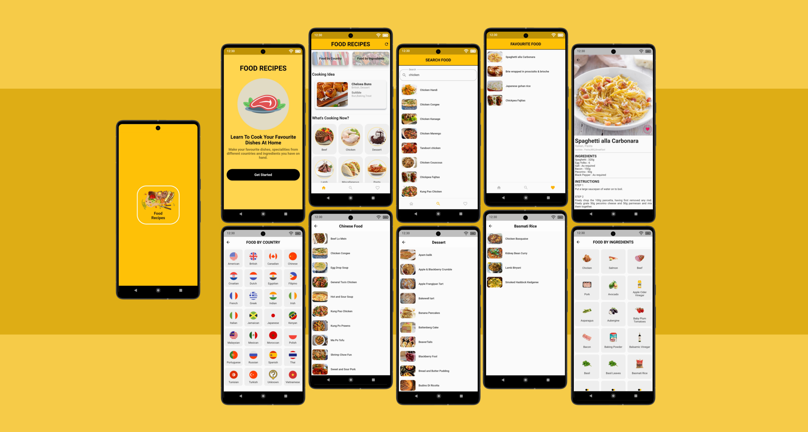

## FOOD RECIPES

This app uses BLoC State Management.

  

  This food recipe application contains recipes from different countries, equipped with the right type of time to cook, such as breakfast or dessert. Not only that, this application provides dishes according to the ingredients you have, just customize it.

## Using

API :
- [MEALDB](https://www.themealdb.com/api.php)

Package :
- BLoC
- http
- sqlflite
- shimmer
- sharedpreferences
- lottie

## THANK YOU
😊😊
